## Dokumentacja projektu BAI

### Temat projektu
Stworzenie serwisu do symulacji gry na giełdzie kryptowalut.

***

### Cele projektu
Głównym celem projektu jest zasymulowanie gry na giełdzie kryptowalut oraz sprawdzenie czy podczas gry na giełdzie można się bardziej wzbogacić czy więcej stracić.

***

### Funkcjonalności
Na serwisie można znaleźć następujące postrony:
* *Strona główna*
* *Kursy walut*
* *Zarządzanie portfelem*

Na każdym widoku pojawia się menu u góry strony, na którym znajdują się podstrony oraz biężące saldo (początkowa wartość to zawsze 50 000 zł).

**1. Wyświetlanie bieżących danych o kryptowalutach.**

Na *Stronie Głównej* serwisu jest umieszczona lista czterech głównych kryptowalut ze szczegółami ściągniętymi z API (nazwa, BID, ASK) oraz posiadaną ilośią kryptowaluty (liczone w sztukach). Oprócz tego widodoczne są funkcje (*kup*, *sprzedaj*, *szczegóły*, *usuń*).
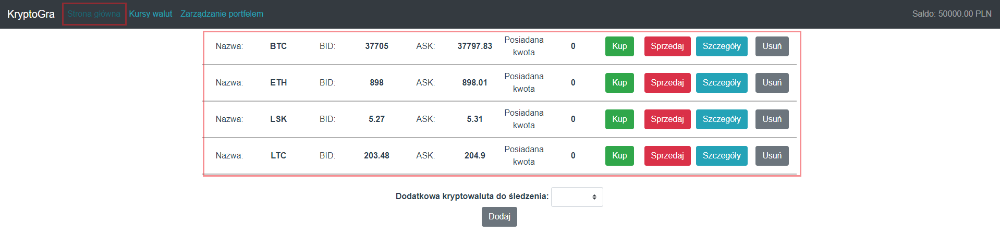

Szczegóły dotyczące danej kryptowaluty można zobaczyć po kliknięciu przycisku *Szczegóły*. Są tam wyświetlane dane z ostatnich kilku godzin w formie wykresów (kupno i sprzedaż)
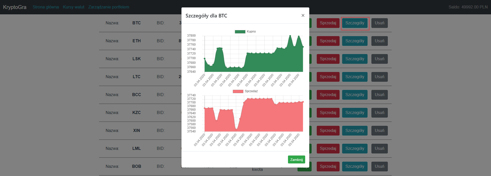

**2. Dodawanie dedykowanych kryptowalut do listy śledzonych pozycji.**

Na *Stronie Głównej* jest dostępna funkcja do dodania nowych kryptowalut do bieżąco wyświetlanej listy. Po wyborze kryptowaluty i kliknięciu przycisku *Dodaj* nowy wiersz pojawia się w tabeli kryptowalut.
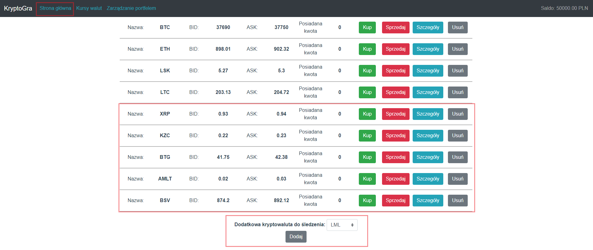

**3. Zakupy i sprzedaż kryptowalut wykorzystując wirtualny portfel.**

Na postronie *Strona Główna* znajdują się kryptowaluty, które można kupić albo sprzedać.
* Po kliknięciu w przycisk *Kup* przy danej kryptowalucie pokazuje się okno, w którym należy podać ilość waluty do kupna.
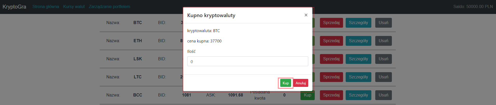

* Po kliknięciu przycisku *Kup* może się okazać, że nie ma się wystarczającej kwoty na zakup danej kryptowaluty - wtedy pojawia się komunikat wraz z wykazem brakującej kwoty.
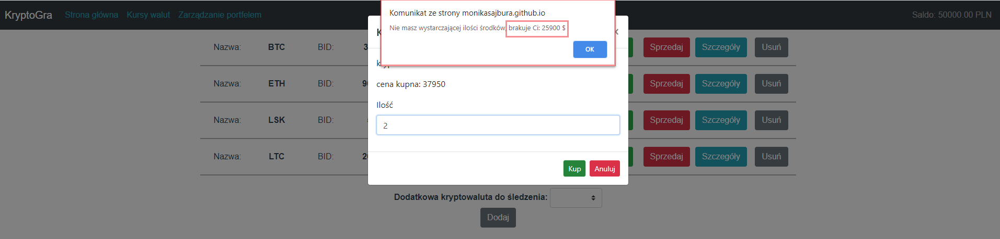

* Po poprawnie wprowadzonej i zakupionej walucie, w kolumnie *Posiadana kwota* pojawia się ilość zakupionej kryptowaluty, a saldo w prawym górnym rogu zmnienia wartość.
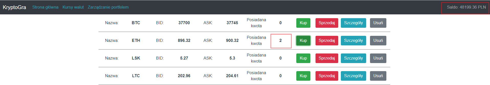

* Podobny sposób działania jak przy kupnie zastosowany jest przy sprzedaży. Po kliknięciu przycisku *Sprzedaj* przy danej kryptowalucie pokazuje się okno, w którym należy podać ilość waluty do sprzedaży.
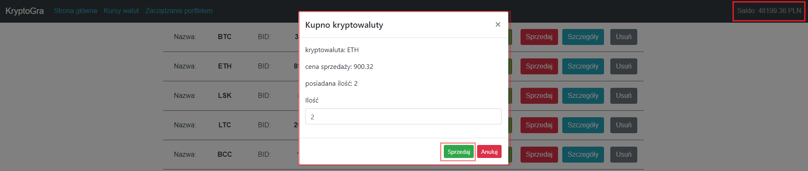

* Po kliknięciu przycisku *Sprzedaj* może się okazać, że nie ma się wystarczającej ilości posiadanej kryptowaluty na jej sprzedaż - wtedy pojawia się komunikat wraz z wykazem brakującej ilości.
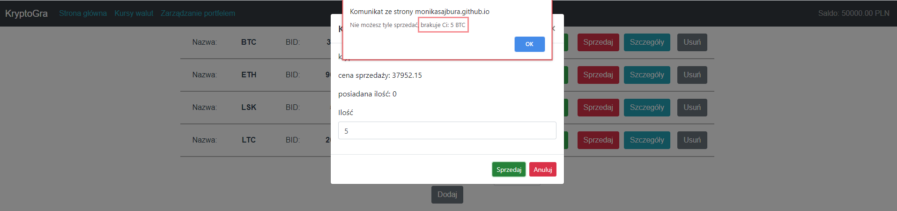

* Po poprawnie wprowadzonej i sprzedanej walucie, w kolumnie *Posiadana kwota* znika adekwatnie do wprowadzonej wartości, ilość kryptowaluty, a saldo w prawym górnym rogu zmnienia wartość.
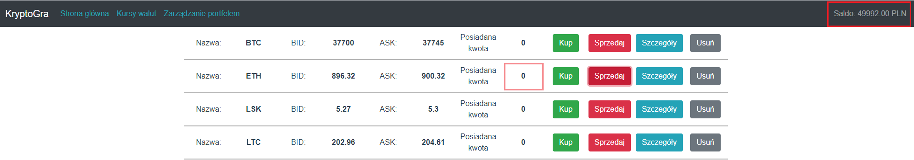

**4. Wyświetlanie bieżących kursów walut.**

Na podstronie *Kursy Walut* jest umieszczona lista najpopularniejszych walut na świecie ściągniętych z API (waluta, kod, kupno, sprzedaż)
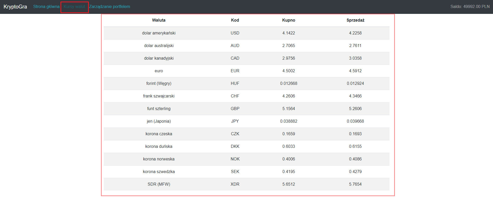

**5. Wyświetlanie danych na witrualnym portfelu.**

Na podstronie *Zarządzanie portfelem* znajdują się następujące opcje wyświetlania danych z całego serwisu:
* Saldo - pokazuje aktualne saldo portfela
* Zysk - pokazuje zysk uzyskany ze wszystkich transakcji
* Zainwestowane pieniądze - pokazuje dotychczas zainwestowane pieniądze
* Dochód lub utrata - pokazuje kwotę uzyskaną lub utraconą po zsumowaniu zainwestowanych pieniędzy i zysku.
* Posiadane waluty (waluta, ilość) - pokazuje stan pozyskanych walut przy kupnie lub sprzedaży
* Posiadane kryptowaluty (kryptowaluta, ilość) - pokazuje zakupione kryptowaluty.
* Historia zakupionych kryptowalut (data, ilość, bilans, status, kryptowaluta) - pokazuje historie wszystkich transakcji na krytpowalutach. Data ukazywana jest w skróconym formacie (DD.MM.YYYY HH:MM:SS) pozysiwana w czasie rzeczywistym po transakacjach. Na historii widoczne są dwa statusy: kupione i sprzedane.

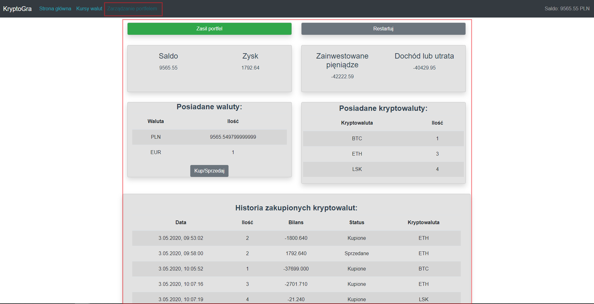

**6. Wirtualny portfel z możliwością przewalutowania na inną walutę po aktualnym kursie nbp.**

Na podstronie *Zarządzanie Portfelem* jest dostępna opcja do przewalutowania obecnej waluty. Po kliknięciu przycisku *Kup/Sprzedaj* pojawia się okno z 3 walutami pobranymi z API (waluta, kod, cena kupna, cena sprzedaży). Po wybraniu waluty należy wprowadzić ilość i wybrać opcję kup/sprzedaj, a następnie kliknąć przysisk wymień, aby obecna waluta (w złotówkach) została wymieniona na inną walutę.
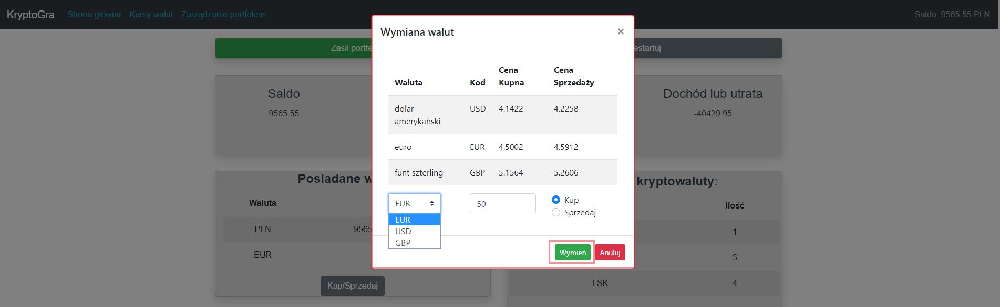

**7. Zasilenie portfela.**

Na podstronie *Zarządzanie portfelem* jest dostępna opcja *Zasil portfel*, po jej kliknięciu pojawia się okno do wprowadzenia kwoty do zasilenia portfela. Po zatwierdzeniu przyskiem *Zasil* bieżące saldo powiększa się o wprowadzoną kwotę.
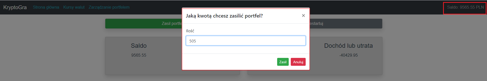

**8. Przywrócenie stanu początkowego portfela**

Na podstronie *Zarządzanie portfelem* znajduje się opcja *Restartuj* do przywrócenia stanu początkowego. Po jej kilknięciu wszystkie wprowadzone wartości na każdej podstronie oraz dodatkowe pozycje na liście kryptowalut kasują się, a gra rozpoczyna się od początku. 
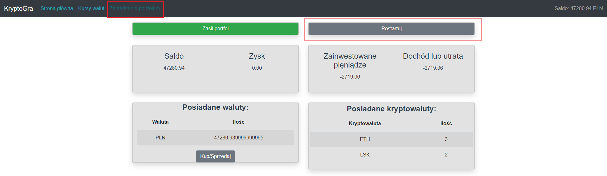

***
### Wersja mobilna

Dzięki Vue Boostrap serwis jest także dostępny i skalowalny w wersji mobilnej. Wszystkie funkcjonalności działają i są dostosowane do widoku mobilnego. Menu zawinięte zostaje w formie 3 poziomych kresek widoczne w prawym górnym rogu.

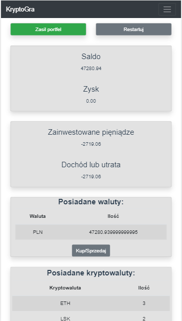

*** 

### Linki do składowych projektu
[Link do projektu zamieszczonego na GitHub Pages](https://monikasajbura.github.io/BAI_projekt/)
[Link do repozytorium projektu](https://github.com/MonikaSajbura/BAI_projekt)
[Link do zarządzania projektu na GitHub](https://github.com/MonikaSajbura/BAI_projekt/projects/1)

#### API
* [Dane o cenach kryptowalut](https://bitbay.net/pl/api-publiczne)
* [Kursy walut](http://api.nbp.pl/)

#### Języki
* Vue.js
* Typescript

#### Style
[Vue bootstrap](https://bootstrap-vue.org/docs)

#### Zewnętrzne komponenty
[Chart.js](https://www.chartjs.org/)

#### Dodatki
* Routing stworzony za pomocą *vue-router*
* Kontrolki *formGroup*
* Dekoratory klas *vue-property-decorator*

#### Wersje
```javascript
 "@types/chart.js": "^2.9.19"
 "bootstrap": "^4.4.1"
 "bootstrap-vue": "^2.11.0"
 "chart": "^0.1.2"
 "chart.js": "^2.9.3"
 "core-js": "^3.6.4"
 "vue": "^2.6.11"
 "vue-chartjs": "^3.5.0"
 "vue-class-component": "^7.2.3"
 "vue-google-charts": "^0.3.2"
 "vue-mc": "^0.6.0"
 "vue-property-decorator": "^8.4.1"
 "vue-router": "^3.1.6"
 "vuex": "^3.1.3"
```
